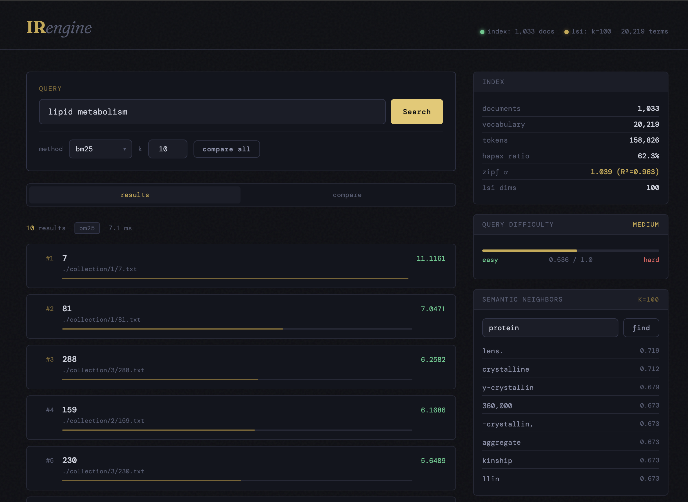
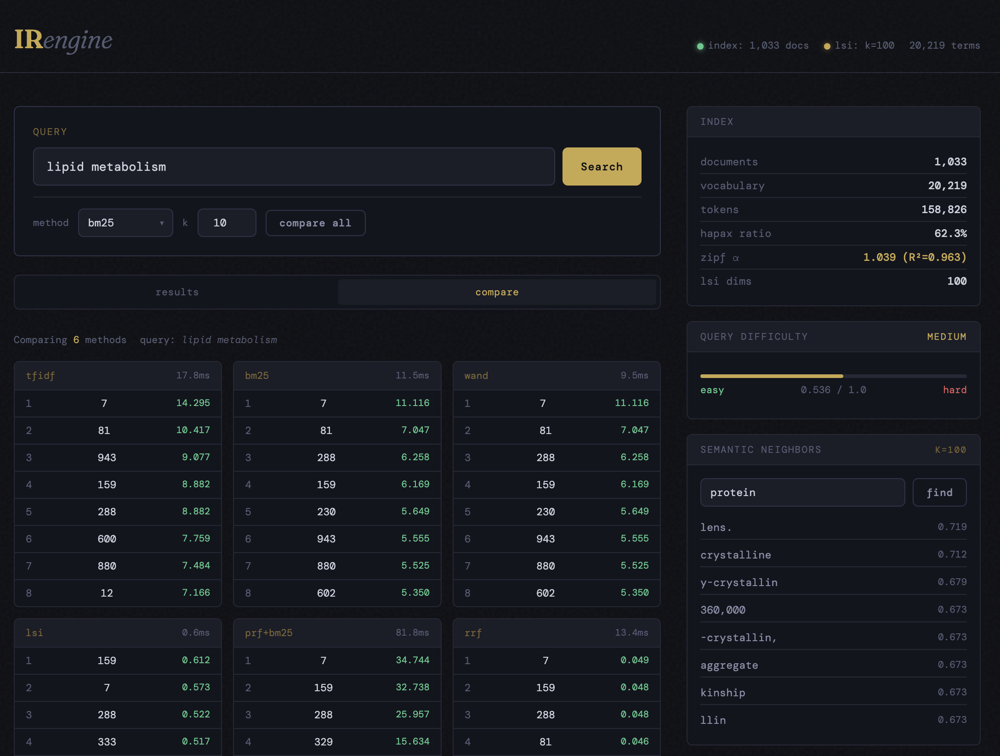
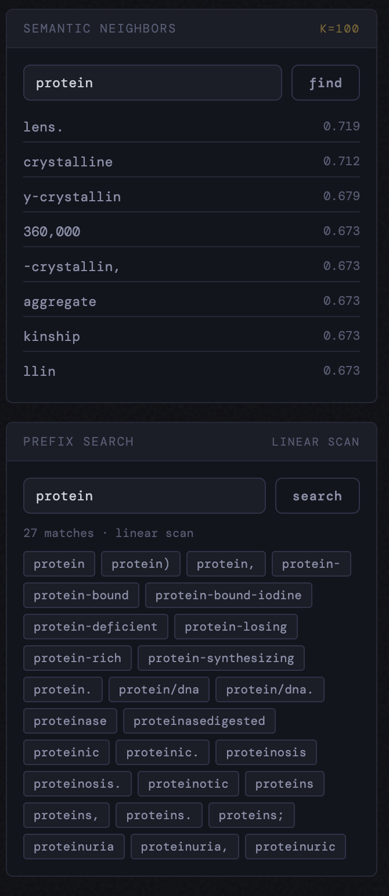
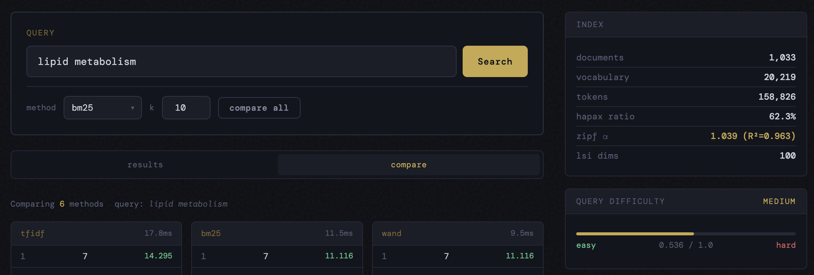

# 🔍 Search Engine from Scratch

A fully functional Information Retrieval (IR) search engine built from scratch in Python.
Implements BSBI/SPIMI indexing, multiple compression codecs, BM25/TF-IDF/WAND/LSI retrieval,
query expansion, rank fusion, and a full evaluation suite — all accessible through one unified CLI.

> **Nama**: Muhammad Hafiz
> **NPM**: 2206082732
> **Course**: Teknologi Basis Informasi (TBI) — Tugas Pemrograman 2  
> **Faculty**: Fasilkom UI

> **Website**: https://tbi-tp2.hafizmuh.site/

---

## 📁 Project Structure

```
.
├── collection/                # Document corpus (one subfolder = one BSBI block)
├── index/                     # Generated index files (auto-created)
├── tmp/                       # Temporary spill files during indexing
│
├── ── Core (Tugas Wajib) ────────────────────────────────────────────
├── bsbi.py                    # BSBI indexing + TF-IDF / BM25 / WAND retrieval
├── compression.py             # StandardPostings, VBEPostings, EliasGammaPostings
├── evaluation.py              # RBP, DCG, NDCG, AP + engine-agnostic eval loop
├── index.py                   # InvertedIndex R/W + term_max_tf for WAND
├── util.py                    # IdMap, sorted_merge_posts_and_tfs
├── search.py                  # Simple multi-method retrieval demo
│
├── ── Bonus ─────────────────────────────────────────────────────────
├── spimi.py                   # SPIMI indexing with configurable memory spills
├── patricia_tree.py           # Patricia Tree / PatriciaIdMap (used by SPIMI)
├── lsi.py                     # Latent Semantic Indexing via truncated SVD
├── query_expansion.py         # PRF Rocchio + PMI Co-occurrence query expansion
├── ranked_fusion.py           # RRF, Condorcet, CombMNZ/CombSUM rank fusion
├── compression_benchmark.py   # EliasGammaDelta + VBEEliasGammaTF + benchmark suite
├── index_inspector.py         # Zipf analysis, vocab stats, query difficulty predictor
├── search_cli.py              # Unified CLI integrating all modules above
├── test_suite.py              # Automated test suite (unit + integration + LSI)
├── app.py                     # FastAPI web interface
├── templates/
│   └── index.html             # Single-page search UI
│
├── qrels.txt                  # Relevance judgments
├── queries.txt                # 30 evaluation queries
├── requirements.txt
└── README.md
```

---

## 🚀 Getting Started

```bash
# 1. Clone and enter the repo
git clone https://github.com/Hafizmuh18/search-engine-tbi
cd search-engine-tbi

# 2. Create and activate virtual environment
python -m venv env
source env/bin/activate        # Linux / macOS
env\Scripts\activate           # Windows

# 3. Install dependencies
pip install -r requirements.txt
```

**requirements.txt**
```
tqdm
numpy
scipy
scikit-learn
fastapi
uvicorn[standard]
```

---

## 🛠️ Usage — Unified CLI

Everything runs through `search_cli.py` with subcommands.

```
python search_cli.py --help
python search_cli.py <subcommand> --help
```

---

### `index` — Build the Inverted Index

```bash
# Default: BSBI + VBE compression
python search_cli.py index

# SPIMI + best-compression hybrid codec
python search_cli.py index --method spimi --encoding vbe-eg-tf

# SPIMI + Adaptive Elias-Gamma/Delta, custom memory limit
python search_cli.py index --method spimi --encoding eg-delta --max-tokens 200000

# Build index then immediately benchmark all codecs
python search_cli.py index --encoding vbe --bench-after
```

| Flag | Default | Description |
|---|---|---|
| `--method` | `bsbi` | `bsbi` or `spimi` |
| `--encoding` | `vbe` | `standard` · `vbe` · `elias` · `eg-delta` · `vbe-eg-tf` |
| `--max-tokens` | `150000` | SPIMI: token pairs per memory spill |
| `--bench-after` | off | Run codec benchmark right after indexing |

> ⚠️ If you change `--encoding`, delete `index/` and re-run `index`.

---

### `search` — Run a Single Query

```bash
# Basic BM25 query
python search_cli.py search --query "lipid metabolism"

# Change method and result count
python search_cli.py search --query "protein synthesis" --method bm25 --k 20

# Show query difficulty prediction before results
python search_cli.py search --query "cell division" --difficulty --method prf+bm25

# Reciprocal Rank Fusion of BM25 + WAND + LSI
python search_cli.py search --query "toxemia pregnancy" --method rrf

# Compare every available method side-by-side with timing
python search_cli.py search --query "alkylated iodoacetate" --compare

# Full doc paths and raw float scores
python search_cli.py search --query "lipid metabolism" --method lsi --verbose
```

| Flag | Default | Description |
|---|---|---|
| `--query` | *(required)* | Query string |
| `--method` | `bm25` | See method table below |
| `--k` | `10` | Number of results |
| `--compare` | off | Top-5 from every method side-by-side with ms timing |
| `--difficulty` | off | IDF-based query difficulty prediction |
| `--verbose` | off | Full doc paths and raw scores |

**Available retrieval methods:**

| Method | Description |
|---|---|
| `tfidf` | TF-IDF, log-normalized |
| `bm25` | Okapi BM25 (k1=1.2, b=0.75) |
| `wand` | BM25 accelerated with WAND Top-K |
| `lsi` | Latent Semantic Indexing (cosine similarity in SVD space) |
| `prf+bm25` | Pseudo-Relevance Feedback (Rocchio) → BM25 |
| `cooc+bm25` | PMI Co-occurrence expansion → BM25 |
| `prf+lsi` | PRF expansion → LSI |
| `rrf` | Reciprocal Rank Fusion (BM25 + WAND [+ LSI if loaded]) |
| `condorcet` | Condorcet pairwise voting fusion |
| `combmnz` | CombMNZ normalized score fusion |
| `combsum` | CombSUM normalized score fusion |

---

### `eval` — Evaluate Retrieval Methods

Runs all selected methods over all 30 queries and reports RBP, DCG, NDCG, and MAP.

```bash
# Default: tfidf bm25 wand prf+bm25 rrf
python search_cli.py eval

# Custom method selection
python search_cli.py eval --methods bm25 wand rrf condorcet combmnz

# Include LSI (build it first with: python search_cli.py lsi build)
python search_cli.py eval --methods tfidf bm25 wand lsi prf+bm25 rrf

# Evaluate with a specific compression codec
python search_cli.py eval --encoding vbe-eg-tf --methods bm25 wand

# Also show Jaccard overlap between method result sets on a sample query
python search_cli.py eval --methods bm25 wand rrf --overlap
```

| Flag | Default | Description |
|---|---|---|
| `--methods` | `tfidf bm25 wand prf+bm25 rrf` | Space-separated list |
| `--k` | `1000` | Top-K documents per query |
| `--encoding` | `vbe` | Compression codec used when loading the index |
| `--overlap` | off | Print Jaccard overlap between method result sets |

**Example output** (measured on the provided collection, 30 queries, k=1000):
```
══════════════════════════════════════════════════════════════════
  Method                    RBP      DCG     NDCG      MAP
  ──────────────────────── ──────── ──────── ──────── ────────
  tfidf                    0.5980   4.9465   0.8150   0.5781
  bm25                     0.6371   5.1051   0.8292   0.6060
  wand                     0.6371   5.1051   0.8292   0.6060
══════════════════════════════════════════════════════════════════

  Best RBP  : bm25 / wand (0.6371)
  Best NDCG : bm25 / wand (0.8292)
  Best MAP  : bm25 / wand (0.6060)
```

Notable: BM25+WAND produces **identical scores** to brute-force BM25, confirming WAND
correctly skips only non-competitive documents without sacrificing result quality.

---

### `lsi` — Latent Semantic Indexing

```bash
# Build LSI model (must have index built first)
python search_cli.py lsi build

# Build with more latent dimensions for higher recall
python search_cli.py lsi build --n-components 200

# Query directly via LSI
python search_cli.py lsi query --query "protein synthesis"

# Find semantically related terms (demonstrates synonym handling)
python search_cli.py lsi related --term "protein"

# Show model metadata (file size, variance explained, etc.)
python search_cli.py lsi info
```

| Action | Description |
|---|---|
| `build` | TF-IDF sparse matrix → randomized truncated SVD → save |
| `query` | Fold query into latent space, rank by cosine similarity |
| `related` | Find terms closest to a given term in latent space |
| `info` | Model size, components, % variance explained |

---

### `inspect` — Index Health Analytics

```bash
# Full report: all sections + sample query difficulty predictions
python search_cli.py inspect

# Individual sections
python search_cli.py inspect --section vocab
python search_cli.py inspect --section zipf
python search_cli.py inspect --section lengths
python search_cli.py inspect --section compression

# Predict difficulty for a specific query
python search_cli.py inspect --difficulty "the of and"
python search_cli.py inspect --difficulty "alkylated with radioactive iodoacetate"
```

| Section | What it shows |
|---|---|
| `vocab` | Vocabulary size, hapax legomena %, top-N terms by DF |
| `zipf` | Fitted Zipfian exponent α, goodness-of-fit R² |
| `lengths` | Doc length percentiles, ASCII histogram, outlier detection |
| `compression` | Theoretical vs actual index size, stop word candidates |
| `--difficulty` | Per-term IDF, avg IDF, expected results, difficulty label |

**Sample outputs** (measured on the provided collection):
```
  Fitted α = 1.040  (R² = 0.963)
  ✓ Excellent fit to Zipf's law

  Query: "the of and"
  Specificity: 0.003 / 1.0
  Difficulty : HARD (very common terms, low discrimination)
  Expected results: ~972

  Query: "alkylated radioactive iodoacetate"
  Term          DF     IDF
  alkylated      1   6.536
  radioactive   14   4.267
  iodoacetate    1   6.536
  Specificity: 0.833 / 1.0
  Difficulty : EASY (specific terms, many good candidates)
  Expected results: ~1
```

---

### `bench` — Compression Codec Benchmark

```bash
# Full benchmark: size + speed for all 5 codecs on synthetic data
python search_cli.py bench

# Correctness check only (no timing)
python search_cli.py bench --verify
```

**All five codecs:**

| Codec | Strategy | Compression ratio |
|---|---|---|
| `StandardPostings` | Raw 4-byte ints | 1.0× (baseline) |
| `VBEPostings` | Byte-level VBE, gap-encoded docIDs | ~8× |
| `EliasGammaPostings` | Bit-level Elias-Gamma | ~9.5× |
| `EliasGammaDeltaPostings` | Adaptive EG/ED per gap (crossover at 16) | ~9.1× |
| `VBEEliasGammaTF` | VBE for docID gaps + EG for TF values | **~10.4×** |

---

### `repl` — Interactive Search REPL

```bash
# Start with defaults (bm25, k=10)
python search_cli.py repl

# Start with RRF and larger result set
python search_cli.py repl --method rrf --k 15

# SPIMI index with best-compression codec
python search_cli.py repl --index-method spimi --encoding vbe-eg-tf
```

**REPL commands:**

```
╔══════════════════════════════════════════════════════╗
║         Search Engine — Interactive REPL             ║
╠══════════════════════════════════════════════════════╣
║  <query>              search with current method     ║
║  :method <n>       bm25|tfidf|wand|lsi|prf+bm25  ║
║                       rrf|condorcet|combmnz|...      ║
║  :k <n>               change result count            ║
║  :compare  <query>    all methods side-by-side       ║
║  :difficulty <query>  IDF-based difficulty score     ║
║  :prefix <pfx>        Patricia prefix search         ║
║  :related <term>      LSI semantic neighbors         ║
║  :inspect [section]   vocab|zipf|lengths|compression ║
║  :bench               compression codec benchmark    ║
║  :fusion <query>      compare RRF/Condorcet/CombMNZ  ║
║  :overlap <query>     Jaccard overlap between ranks  ║
║  :help / :quit                                       ║
╚══════════════════════════════════════════════════════╝
```

---

## 🌐 Web Interface

A FastAPI web app provides a browser-based search interface with real-time analytics.

```bash
# Install dependencies (if not already)
pip install -r requirements.txt

# Start the server (index must be built first)
python app.py
# or with auto-reload for development
uvicorn app:app --reload --port 8000
```

Open **http://localhost:8000** in your browser.

---

### Search & Results



The main search panel consists of:

- **Query input** — type any query and press Enter or click Search
- **Method selector** — dropdown with 9 retrieval methods (BM25, TF-IDF, WAND, LSI, PRF+BM25, CoOc+BM25, RRF, Condorcet, CombMNZ). Methods requiring LSI are auto-disabled if the model hasn't been built yet
- **k input** — number of results to return (default: 10)
- **compare all** button — triggers the Compare view (see below)

Each result card shows the document ID, full collection path, a proportional score bar, and the raw float score. The top-3 results are highlighted in amber. Response time and method badge are shown above the result list.

The right sidebar loads automatically on startup and shows:
- **Index stats** — document count (1,033), vocabulary size (20,219), total tokens (158,826), hapax legomena ratio (62.3%), Zipf α (1.039, R²=0.963), and LSI dimensions (100)
- **Query Difficulty** — a live meter that updates 400ms after you stop typing, showing a specificity score from 0.0 (hard) to 1.0 (easy). "lipid metabolism" scores 0.536 → **MEDIUM**
- **Semantic Neighbors** — LSI-powered related term finder (see below)

---

### Compare All Methods



Clicking **compare all** runs every available method simultaneously and renders a grid with one column per method. Each column shows:

- Method name and response time in milliseconds
- Top-8 document IDs with their scores

This view makes cross-method differences immediately visible. From the screenshot above (query: *"lipid metabolism"*):

| Observation | Detail |
|---|---|
| **BM25 = WAND** | Doc 7 → 81 → 288 → 159 in identical order, identical scores (11.116, 7.047, 6.258…). Confirms WAND skips only truly non-competitive docs without losing precision. |
| **LSI diverges** | Doc 159 ranks **#1** via LSI (score 0.612) but only #4 in BM25. LSI discovers semantic similarity that exact-keyword matching misses. |
| **PRF+BM25 amplifies** | Doc 7 score jumps from 11.116 (BM25) to 34.744 (PRF+BM25) — the expanded query reinforces the most relevant document. |
| **RRF consensus** | Doc 7 wins in RRF (rank-fusion score 0.049) because it appears near the top in almost every method. |
| **Speed** | LSI is fastest at **0.6ms** (pre-computed dot product), WAND at 9.5ms, PRF is slowest at 81.8ms (requires an initial retrieval pass + expansion). |

---

### Semantic Neighbors & Prefix Search



**Semantic Neighbors** (top card)

Enter any vocabulary term and click **find** to retrieve the 8 most semantically related terms in the LSI latent space (cosine similarity of L2-normalized document vectors).

Example for `"protein"`:
```
lens.         0.719   ← appears in same documents as protein
crystalline   0.712
y-crystallin  0.679
360,000       0.673
-crystallin,  0.673
aggregate     0.673
kinship       0.673
llin          0.673
```

The results reveal the document context captured by LSI — "protein" clusters with lens/crystalline terms because the collection contains ophthalmology literature about lens proteins. Clicking any result term automatically fills the search box and runs a query.

The card shows the badge `K=100` indicating the number of LSI latent dimensions used. If the LSI model has not been built, the input is disabled and an instructional message with the build command is shown instead.

**Prefix Search** (bottom card)

Enter a prefix and click **search** to find all vocabulary terms starting with those characters.

- **BSBI index** (default): badge shows `LINEAR SCAN` — iterates over `term_id_map.id_to_str`
- **SPIMI index**: badge shows `PATRICIA TREE` — O(k) lookup via the Patricia Tree

Example for `"protein"` (BSBI linear scan, 27 matches):
```
protein   protein)   protein,   protein-   protein-bound
protein-bound-iodine   protein-deficient   protein-losing
protein-rich   protein-synthesizing   protein.   protein/dna
proteinase   proteinasedigested   proteinic   proteinosis
proteinosis.   proteinotic   proteins   proteins,   proteins.
proteins;   proteinuria   proteinuria,   proteinuric
```

Clicking any tag immediately runs it as a search query.

---

### Index & Query Difficulty Panel



The right sidebar is always visible and provides passive intelligence about the collection and the current query:

**Index card** — populated once at startup by calling `/api/inspect/vocab` and `/api/inspect/zipf`:

| Field | Value | Meaning |
|---|---|---|
| documents | 1,033 | Total docs in the collection |
| vocabulary | 20,219 | Unique terms (no stopword removal) |
| tokens | 158,826 | Total token occurrences across all docs |
| hapax ratio | 62.3% | Most terms are very rare — typical of scientific text |
| zipf α | **1.039 (R²=0.963)** | Near-perfect Zipf fit confirms natural language distribution |
| lsi dims | 100 | LSI model built with k=100 latent components |

**Query Difficulty meter** — calls `/api/difficulty` with a 400ms debounce as you type:

- The bar fills left-to-right from red (hard) to green (easy), proportional to the specificity score
- "lipid metabolism" scores **0.536 / 1.0 → MEDIUM** — one common word ("lipid") and one moderately specific word ("metabolism")
- Internally computed as average Robertson IDF of query terms, normalized by `log(N+1)`

---

### REST API

All functionality is accessible programmatically without the UI:

| Method | Endpoint | Body | Description |
|---|---|---|---|
| `GET` | `/api/status` | — | Index + LSI load status, doc/term counts, spimi flag |
| `POST` | `/api/search` | `{query, method, k}` | Run a query, returns ranked hits with scores |
| `POST` | `/api/compare` | `{query, k}` | All methods side-by-side in one response |
| `POST` | `/api/difficulty` | `{query}` | Difficulty prediction with per-term IDF breakdown |
| `POST` | `/api/related` | `{term, k}` | LSI semantic neighbors |
| `POST` | `/api/prefix` | `{prefix}` | Prefix search (Patricia or linear fallback) |
| `GET` | `/api/inspect/vocab` | — | Vocab size, hapax ratio, token count |
| `GET` | `/api/inspect/zipf` | — | Zipf α and R² fit |

```bash
# Example: RRF search via curl
curl -X POST http://localhost:8000/api/search \
  -H "Content-Type: application/json" \
  -d '{"query": "lipid metabolism", "method": "rrf", "k": 10}'

# Example: prefix search
curl -X POST http://localhost:8000/api/prefix \
  -H "Content-Type: application/json" \
  -d '{"prefix": "prot"}'
```

**File structure:**
```
app.py              # FastAPI application — engine + LSI loaded once at startup
templates/
└── index.html      # Single-page UI — no build step, no JS framework required
images/             # Screenshots for README documentation
├── search.png
├── compare.png
├── semantic_neighbors_prefix_search.png
└── index_query.png
```

---

## ✅ Test Results

All tests verified on the provided collection (1,033 documents, 30 queries).

```bash
python test_suite.py --unit    # 17/17 passed
python test_suite.py --index   # 35/35 passed, 2 skipped (optional codecs)
python test_suite.py --full    # 35/35 passed, 3 skipped (LSI not built yet)
```

| Test | Flag | Coverage |
|---|---|---|
| `--unit` | No index needed | Codecs, metrics, Patricia Tree, RRF/CombMNZ logic |
| `--index` | Index must be built | BSBI load, TF-IDF/BM25/WAND, evaluation pipeline, Zipf, PRF, rank fusion |
| `--full` | Index + LSI model | All of the above + LSI retrieval, related terms, variance |

**Key verified numbers from the collection:**

| Metric | TF-IDF | BM25 | BM25+WAND |
|---|---|---|---|
| RBP (p=0.8) | 0.5980 | **0.6371** | 0.6371 |
| DCG | 4.9465 | **5.1051** | 5.1051 |
| NDCG | 0.8150 | **0.8292** | 0.8292 |
| MAP | 0.5781 | **0.6060** | 0.6060 |

BM25+WAND produces **identical scores** to brute-force BM25 while skipping
non-competitive documents — confirming the WAND upper bound implementation is correct.

Zipf's law fit on this collection: **α = 1.040, R² = 0.963** — an excellent fit,
consistent with natural-language English text.

---

**Elias-Gamma** (`compression.py`) — Encodes `n` as `k` zero bits + binary of `n` in `k+1` bits, `k = ⌊log₂n⌋`. Gap-encoded for docIDs with `+1` offset to guarantee all values ≥ 1.

**BM25 pre-computation** (`index.py`) — `doc_length[doc_id]` and `term_max_tf[term_id]` are accumulated by `InvertedIndexWriter.append()` at index time and persisted in the `.dict` metadata file alongside `postings_dict`.

**WAND upper bound** (`bsbi.py`) — `UB(t) = IDF(t) × (max_tf × (k1+1)) / (max_tf + k1 × (1-b + b × min_dl/avgdl))`. Using minimum document length gives a tighter bound and skips more documents.

**SPIMI** (`spimi.py`) — Builds in-memory `{term_str → {doc_id → tf}}` dict token by token; spills to disk when `max_tokens_per_block` is exceeded; N-way merges all spills. Uses `PatriciaIdMap` as term dictionary instead of plain `dict`.

**Patricia Tree** (`patricia_tree.py`) — Radix tree where single-child chains are merged into multi-character edge labels. Drop-in replacement for `util.IdMap` with the same `map[str]`/`map[int]` interface plus `starts_with(prefix)` for prefix search.

**LSI** (`lsi.py`) — `scipy.sparse.csr_matrix` TF-IDF matrix → `sklearn.utils.extmath.randomized_svd` → L2-normalized doc vectors. Query folding-in: `q_latent = U_kᵀ · q_tfidf`. Never materializes the full dense matrix.

**Query Expansion** (`query_expansion.py`) — PRF Rocchio: `q_new = α·q_orig + β·(1/|R|)·Σd_i`. PMI Co-occurrence: `log(df(t_q ∩ t_c) · N / (df(t_q) · df(t_c)))`.

**Rank Fusion** (`ranked_fusion.py`) — RRF: `score(d) = Σ 1/(60 + rank_r(d))`, rank-only and immune to score scale differences between methods. Condorcet: pairwise win counts. CombMNZ: min-max normalized score × number of retrievers that returned the document.

**VBEEliasGammaTF** (`compression_benchmark.py`) — Exploits that DocID gaps have varied distribution (→ VBE is robust) while TF values cluster near 1 (→ Elias-Gamma is optimal: TF=1 encodes to 3 bits vs 8 bits in VBE).

**`evaluation.py`** — `eval()` and `eval_retrieval()` are fully engine-agnostic. They accept any callable `(query, k) → List[(score, doc)]`, enabling consistent evaluation of BSBI, SPIMI, LSI, PRF, and RRF through the same code path.

---

## 📊 Full Feature Matrix

| Feature | File | Category |
|---|---|---|
| Elias-Gamma bit-level compression | `compression.py` | Tugas 1 |
| BM25 scoring | `bsbi.py` | Tugas 2 |
| DCG / NDCG / AP evaluation metrics | `evaluation.py` | Tugas 3 |
| WAND Top-K retrieval | `bsbi.py` | Tugas 4 |
| SPIMI indexing | `spimi.py` | Bonus |
| Patricia Tree term dictionary | `patricia_tree.py` | Bonus |
| Latent Semantic Indexing (truncated SVD) | `lsi.py` | Bonus |
| PRF Rocchio + PMI Co-occurrence expansion | `query_expansion.py` | Bonus |
| RRF + Condorcet + CombMNZ rank fusion | `ranked_fusion.py` | Bonus |
| EliasGammaDelta + VBEEliasGammaTF codecs | `compression_benchmark.py` | Bonus |
| Zipf analysis + query difficulty predictor | `index_inspector.py` | Bonus |
| Unified CLI (7 subcommands, fully integrated) | `search_cli.py` | Bonus |
| Automated test suite (unit + integration + LSI) | `test_suite.py` | Bonus |
| FastAPI web interface with REST API | `app.py` + `templates/index.html` | Bonus |

---

## 📚 References

- Manning, Raghavan & Schütze — *Introduction to Information Retrieval* (Ch. 4, 5, 7, 18)
- Robertson & Zaragoza — *The Probabilistic Relevance Framework: BM25 and Beyond*
- Broder et al. — *Efficient query evaluation using a two-level retrieval process* (WAND, 2003)
- Deerwester et al. — *Indexing by Latent Semantic Analysis* (1990)
- Cormack, Clarke & Buettcher — *Reciprocal Rank Fusion outperforms Condorcet* (2009)
- Elias — *Universal codeword sets and representations of the integers* (1975)
- Morrison — *PATRICIA — Practical Algorithm To Retrieve Information Coded In Alphanumeric* (1968)
- Haldar & Mukhopadhyay — *Pseudo-Relevance Feedback and Query Expansion*